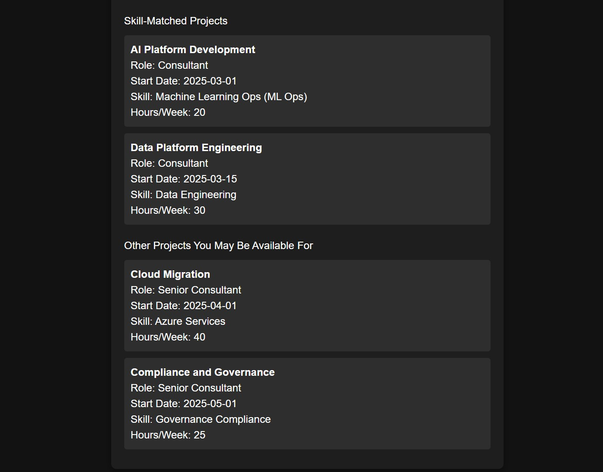

## Staffing Matcher
This is a POC web application that matches IS members to projects based on their skillset and availability. Built with Azure OpenAI and NextJS.
The application returns projects that meet the required user inputs, as well as a secondary list of projects that a user may still want to consider but don't meet all of the requirements (ex: extra hours, different skillset, etc.)

Sample input/output:




## Getting Started

Run the development server:

```bash
npm run dev
# or
yarn dev
# or
pnpm dev
# or
bun dev
```
This is a [Next.js](https://nextjs.org) project bootstrapped with [`create-next-app`](https://nextjs.org/docs/app/api-reference/cli/create-next-app).

