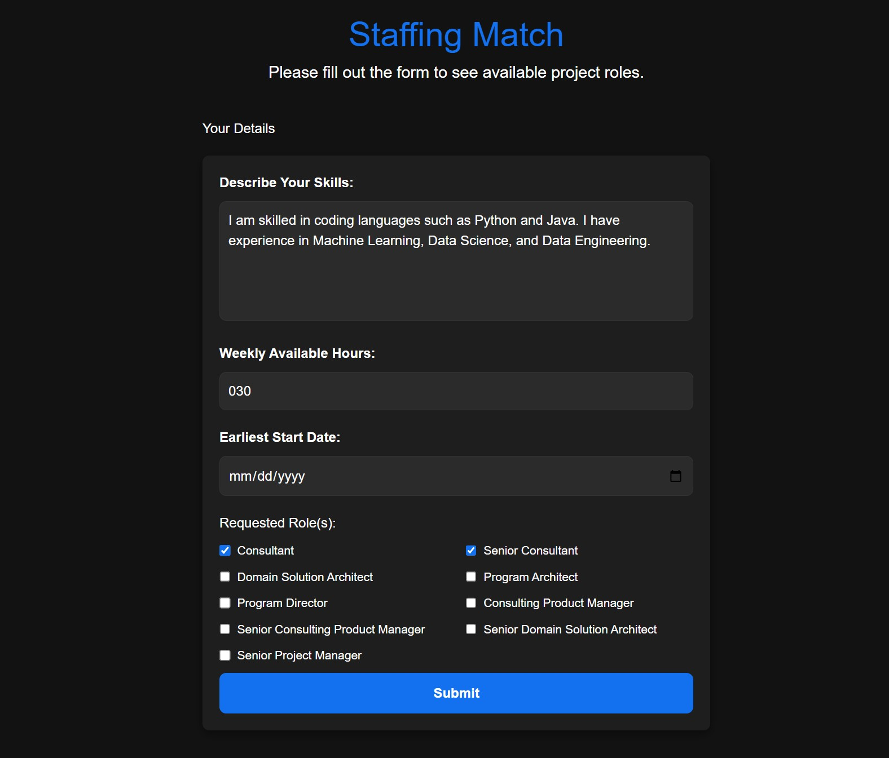

## Staffing Matcher
This is a POC web application that matches IS members to projects based on their skillset and availability. Built with Azure OpenAI and NextJS.

Sample input/output:




## Getting Started

Run the development server:

```bash
npm run dev
# or
yarn dev
# or
pnpm dev
# or
bun dev
```
This is a [Next.js](https://nextjs.org) project bootstrapped with [`create-next-app`](https://nextjs.org/docs/app/api-reference/cli/create-next-app).

